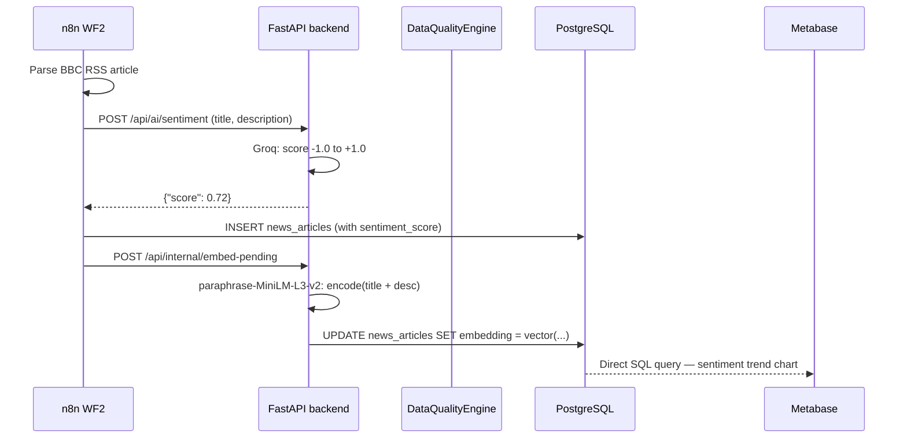
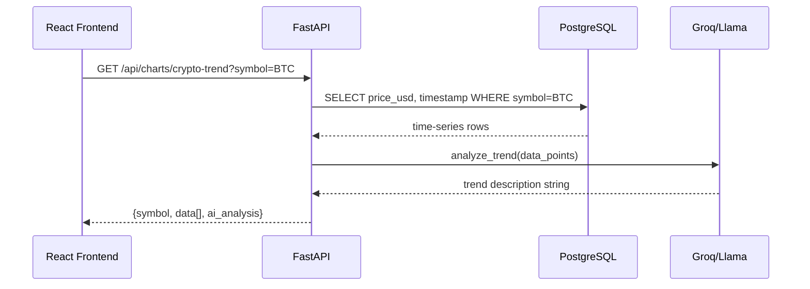
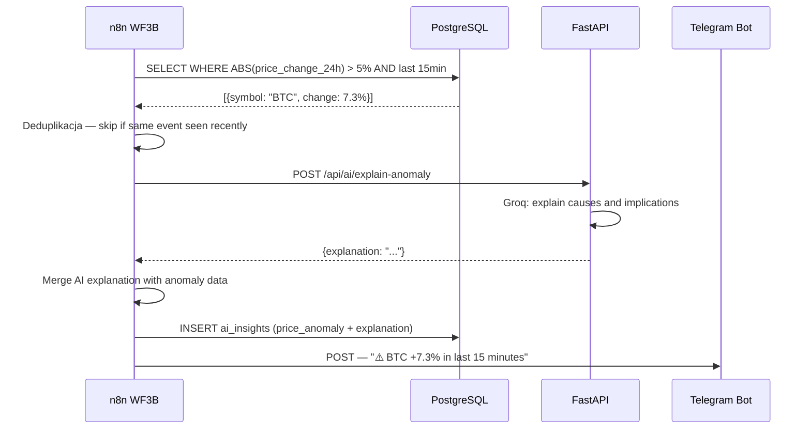
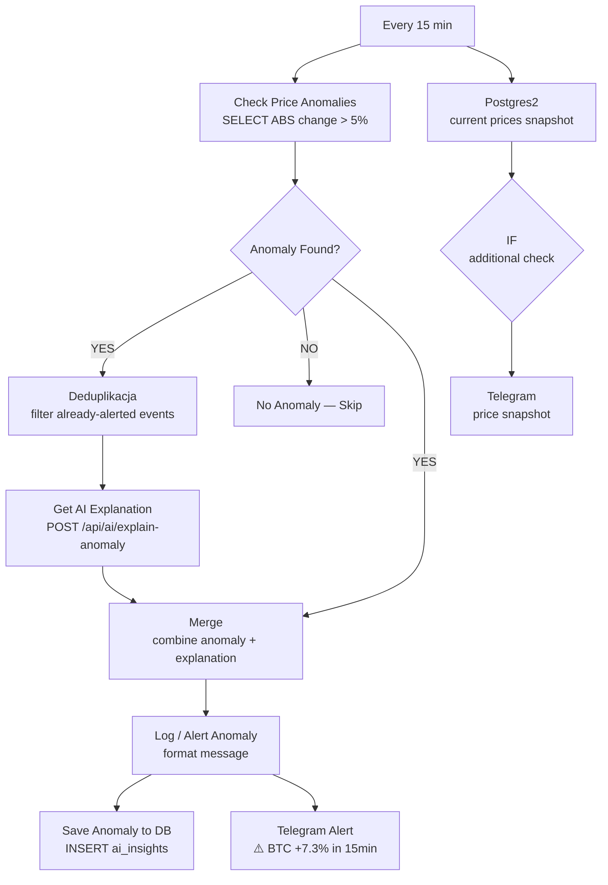

# Projekt5 — Internal Architecture & Developer Notes

> This document describes the detailed architecture, data flow, and technical decision rationale for the AI-Powered BI Dashboard. Intended for developers and recruiters who want to understand _why_ the system works the way it does.

---

## Table of Contents

1. [Project Structure](#1-project-structure)
2. [Module Reference](#2-module-reference)
3. [Data Flow](#3-data-flow)
4. [n8n Workflow Internals](#4-n8n-workflow-internals)
5. [Security Architecture](#5-security-architecture)
6. [Data Quality Engine](#6-data-quality-engine)
7. [RAG Pipeline](#7-rag-pipeline)
8. [SQL Transformation Layer — dbt](#8-sql-transformation-layer--dbt)

---

## 1. Project Structure

## 1. Project Structure

```
Projekt5/
├── backend/
│   ├── app.py              # FastAPI application entry point + lifespan scheduler
│   ├── scheduler.py        # Async Binance fetcher + DQ checks + MV refresh
│   ├── ai_insights.py      # Groq/Llama integration: summary, sentiment, anomaly explain
│   ├── analytics.py        # KPI calculation layer (crypto aggregates)
│   ├── database.py         # SQLAlchemy engine + universal execute_query()
│   ├── embeddings.py       # paraphrase-MiniLM-L3-v2 model + pgvector embed logic
│   ├── data_quality/
│   │   ├── __init__.py     # Wires engine with LogReporter + DatabaseReporter
│   │   ├── base.py         # Abstract DataQualityCheck (validate + fix methods)
│   │   ├── checks.py       # NotNullCheck, RangeCheck, UrlFormatCheck, FutureTimestampCheck
│   │   ├── engine.py       # DataQualityEngine — runs chain, returns DQReport
│   │   └── reporters.py    # LogReporter (stdout), DatabaseReporter (ai_insights)
│   ├── Dockerfile          # python:3.11-slim image
│   └── tests/
│       ├── test_checks.py          # Unit tests for all check classes
│       └── test_data_quality.py    # Engine + reporter integration tests
├── frontend/
│   ├── src/
│   │   ├── App.js          # React root component — Bloomberg Terminal dark theme
│   │   └── index.js        # ReactDOM entry point
│   ├── public/
│   │   └── index.html
│   ├── Dockerfile          # CRA dev server — used with docker-compose.dev.yml only
│   ├── Dockerfile.prod     # Multi-stage: Node.js builder + nginx:alpine server
│   └── package.json
├── database/
│   ├── init.sql            # Schema: tables, indexes, materialized views, pgvector HNSW
│   └── init-metabase.sh    # Creates isolated metabase_app database on first run
├── dbt/
│   ├── dbt_project.yml     # Project config: staging → view, marts → table (analytics schema)
│   ├── profiles.yml        # PostgreSQL connection via env vars (POSTGRES_HOST/USER/...)
│   └── models/
│       ├── sources.yml     # Raw source definitions + freshness thresholds
│       ├── staging/        # stg_crypto_prices, stg_news_articles, stg_weather_data
│       └── marts/          # mart_market_daily, mart_dq_failures, mart_dq_trend,
│                           # mart_news_correlation, mart_weekly_summary,
│                           # mart_weather_crypto_correlation  (+schema.yml with tests)
├── metabase/
│   ├── Market_Daily_Overview.json        # Dashboard export (Enterprise)
│   ├── dbt_Analytics_Dashboard.json      # Dashboard export (Enterprise)
│   └── DASHBOARD_SETUP.md                # Manual setup SQL queries (Open Source)
├── n8n/
│   └── workflows/
│       └── workflow.json   # Single file containing all 4 n8n workflows
├── docker-compose.yml      # Production stack: 7 services, memory-limited
├── docker-compose.dev.yml  # Dev override: CRA hot-reload, uvicorn --reload
├── setup.sh                # Automated setup script for first-run
├── .env.example
├── README.md
├── N8N_SETUP_AND_ARCHITECTURE.md
└── INTERNALS.md            # This file
```

### Key concepts

**`n8n/workflows/workflow.json`** is a single file exported from n8n containing all four workflows (crypto ingestion, news+weather, hourly AI summary, anomaly detection). n8n's "Import from File" handles multi-workflow JSON. One file to version-control, one file to import.

**`backend/scheduler.py`** runs as a persistent background asyncio task inside the FastAPI process. It fetches Binance data independently of n8n — continuous ingestion even when n8n is restarting. After each INSERT, it runs the Data Quality Engine and calls `REFRESH MATERIALIZED VIEW CONCURRENTLY mart_market_daily`.

**`frontend/Dockerfile.prod`** uses a two-stage Docker build. Stage 1 compiles React with `node:18-alpine`. Stage 2 copies only `/app/build` into `nginx:alpine`. Zero Node.js or webpack in production — ~40 MB RAM vs ~2–3 GB for CRA dev server.

**`database/init.sql`** is mounted into PostgreSQL at `/docker-entrypoint-initdb.d/`. Executed automatically on first startup when the data directory is empty; skipped on subsequent starts.

**`dbt/`** runs as a dedicated service in `docker-compose.yml`. It installs `dbt-core` + `dbt-postgres`, runs `dbt deps` → `dbt run` → `dbt docs generate` → `dbt docs serve --port 8080` in sequence. Mart models are materialized as tables in the `analytics` schema, staging models as views in the `staging` schema.

---

## 2. Module Reference

### `backend/database.py` — Query Engine

The single point of contact between the application and PostgreSQL. All database calls go through `execute_query()`.

```python
def execute_query(query: str, params: Optional[Dict] = None) -> Optional[List[Dict]]
```

**Connection management:** Uses SQLAlchemy `engine.begin()` which wraps each call in a transaction. Commits on success, rolls back on exception — no manual transaction handling required.

**`pool_pre_ping=True`:** Before each query, SQLAlchemy sends a lightweight `SELECT 1` to verify the connection is alive. Prevents `Connection lost` errors after PostgreSQL restarts without requiring application restart.

**Serialization:** PostgreSQL returns `Decimal` for `DECIMAL` columns and `datetime` for `TIMESTAMP`. Both are non-serializable by Python's standard `json` module. `execute_query()` normalizes both types inline:

```python
float(v) if isinstance(v, Decimal)
else v.isoformat() if isinstance(v, dt)
else v
```

All endpoints return clean JSON without per-endpoint casting.

**Error handling:** `SQLAlchemyError` is caught, logged with the full query text (for debugging), then re-raised — allowing FastAPI's exception handler to produce a proper `500` response.

---

### `backend/scheduler.py` — Async Data Fetcher

Runs as a background asyncio task inside the FastAPI process lifecycle. Fetches real-time crypto data from Binance every 5 minutes.

**Why asyncio instead of a thread?** FastAPI is built on Starlette's async event loop. A synchronous thread would block the loop during HTTP calls. `httpx.AsyncClient` keeps I/O non-blocking — the API stays responsive while the scheduler waits for Binance.

**Binance API parameter encoding:**

Binance's `/ticker/24hr` requires `symbols` as `["BTCUSDT","ETHUSDT",...]` — a JSON array as a query string value. Standard URL encoding of brackets breaks Binance (`400 Bad Request`). Fix uses `httpx.Request` directly:

```python
req = httpx.Request("GET", BINANCE_URL, params={"symbols": symbols_str})
resp = await client.send(req)
```

**Bulk INSERT strategy:** One SQL statement for all 20 tickers instead of 20 round-trips:

```sql
INSERT INTO crypto_prices (symbol, price_usd, market_cap, volume_24h, price_change_24h)
VALUES ('BTC', 71389.73, 0, 1584848373, -3.8550),
       ('ETH', 2188.29, 0, 921172981, -6.0490), ...
ON CONFLICT DO NOTHING
```

**DQ integration:** Before INSERT, each record passes through `DataQualityEngine.run()`. The engine returns `(DQReport, clean_record)`. Only `clean_record` (auto-repaired or original) is inserted. `DatabaseReporter` writes failures to `ai_insights` automatically.

**Metadata tracking:** After INSERT, updates `dq_metadata` with `last_successful_ts` and `rows_inserted` — used by dbt's freshness check.

**Materialized view refresh:** Calls `REFRESH MATERIALIZED VIEW CONCURRENTLY mart_market_daily` after each successful ingest cycle. `CONCURRENTLY` allows Metabase to read the view without interruption during refresh. Refresh errors are silently swallowed so they don't block the data pipeline.

**Data retention:** After INSERT, deletes records older than 30 days. 288 rows/day × 20 symbols × 30 days = max ~172,800 rows — sufficient for trend analysis, avoids unbounded growth.

---

### `backend/ai_insights.py` — Groq/Llama Integration

Four distinct AI functions, each with a different role:

**`generate_daily_summary(metrics)`** — Takes aggregated market data dict, returns structured JSON with `summary`, `insights[]`, `recommendations[]`. Called by n8n WF3A every hour; result is cached in `ai_insights` and forwarded to Telegram.

**`analyze_trend(data_points, metric_name)`** — Takes time-series data and metric name, returns 2–3 sentence description of trend direction, magnitude, and notable spikes. Called by `/api/charts/crypto-trend`.

**`explain_anomaly(anomaly_data)`** — Takes detected anomaly dict (symbol, price, change%), returns 2–3 sentence explanation of probable causes and implications. Called by n8n WF3B after anomaly deduplication.

**`analyze_sentiment(title, description)`** — Takes news article title+description, returns a float between -1.0 (very negative) and +1.0 (very positive). Called by the `/api/ai/sentiment` endpoint which n8n WF2 calls after BBC RSS ingestion.

**Error handling pattern:** All functions wrap the Groq call in `try/except`. On failure they return a structured fallback dict (never raise) — a single Groq timeout doesn't crash the request. The `error` field is logged but not shown to end users.

---

### `backend/embeddings.py` — Vector Embeddings

```
BBC article arrives → embed(title + description) → vector(384 dims)
                                                        ↓
User query → embed(query) → pgvector cosine search → top-5 articles
                                                        ↓
                                Groq: "Answer {query} using these articles: {context}"
                                                        ↓
                                            Grounded answer + source list
```

**Model:** `paraphrase-MiniLM-L3-v2` from sentence-transformers. Chosen for:

- 384 dimensions (compact, fast cosine search)
- ~80 MB model size (fits in backend container memory budget)
- No API key — runs fully locally
- 10–50 ms per document — fast enough for synchronous embedding at ingestion time

**pgvector HNSW index** (faster than IVFFlat for small-medium corpora):

```sql
CREATE INDEX idx_news_articles_embedding
ON news_articles USING hnsw (embedding vector_cosine_ops);
```

**Embedding freshness:** New articles are embedded immediately after INSERT in n8n WF2 (HTTP POST to `/api/internal/embed-pending`). This endpoint finds all `news_articles WHERE embedding IS NULL` and processes them in batches of 100.

---

### `backend/data_quality/` — Modular DQ Engine

Full design rationale in [Section 6](#6-data-quality-engine). Key implementation notes:

**`DataQualityCheck` ABC forces two contracts:**

- `validate(record) -> bool` — returns True if record is clean
- `fix(record) -> dict` — attempts automatic repair, returns (possibly modified) record

**`DataQualityEngine.run(table, record, record_id)`** chain:

1. Runs all registered checks for the table
2. Collects failures into a `DQReport`
3. Attempts `fix()` on failed records
4. Passes `DQReport` to all configured reporters (`LogReporter` + `DatabaseReporter`)

**`DatabaseReporter`** writes to `ai_insights` only on failure:

```json
{
  "insight_type": "dq_failure",
  "content": {
    "table": "crypto_prices",
    "record_id": "BTC",
    "failed_checks": ["RangeCheck:price_change_24h[-100,100]"],
    "total_checks": 4,
    "auto_repaired": false,
    "original_record": { "price_change_24h": 150.0 },
    "fixed_record": null,
    "checked_at": "2026-04-17T14:12:00Z"
  }
}
```

This makes DQ failures visible in Metabase alongside business metrics — no separate monitoring system required.

---

## 3. Data Flow

### Ingestion → Storage → Presentation



### Query → Dashboard



### Anomaly Detection → Alert



---

### Dual ingestion — why both scheduler and n8n do the same thing

The backend scheduler and n8n WF1 both fetch from Binance and insert into `crypto_prices`. This is deliberate redundancy:

- **n8n WF1** runs every **10 minutes** — visible, auditable, activatable/deactivatable without code changes
- **scheduler.py** runs every **5 minutes** — data keeps flowing during n8n container restarts, credential issues, or while workflows are being configured

`ON CONFLICT DO NOTHING` ensures duplicate rows are silently discarded. The scheduler also runs the full DQ pipeline and refreshes materialized views — n8n WF1 does not.

### Database schema design decisions

**No `UNIQUE` constraint on `crypto_prices`:** The table stores a time-series of price snapshots — multiple rows per symbol per day are expected and desirable. Uniqueness would destroy the historical record.

**`dq_metadata` table:** One row per source table, updated after each successful scheduler run with `last_successful_ts` and `rows_inserted`. dbt's freshness check queries this table — warning if `crypto_prices` hasn't been updated in 10 minutes, error after 20 minutes.

**`JSONB` for `ai_insights.content`:** AI responses are semi-structured JSON with varying schemas (daily summary has `insights[]`, anomaly alerts have `affected_symbols[]`, DQ failures have `failed_checks[]`). JSONB stores the full response without schema migrations, supports indexing, and enables `->` operator queries in Metabase.

**`mart_market_daily` MATERIALIZED VIEW:** Cross-domain daily aggregate joining crypto prices, news count, weather data, and DQ failure count. Refreshed every 5 minutes by the scheduler via `REFRESH MATERIALIZED VIEW CONCURRENTLY`. The `UNIQUE INDEX ON mart_market_daily(date)` is required for `CONCURRENTLY` — without it PostgreSQL refuses the concurrent refresh.

---

## 4. n8n Workflow Internals

### Credential isolation

Credentials in n8n are stored encrypted in its internal PostgreSQL schema. The `workflow.json` file contains only `"credentials": {}` — empty objects. Actual credential IDs are assigned at runtime when the user selects `Dashboard PostgreSQL` in the UI. The workflow file is safe to commit to version control.

### WF3A — Hourly AI Summary + Telegram

WF3A fires every hour. It calls `/api/dashboard/overview` to get current KPIs, then `/api/ai/daily-summary` to generate a Llama 3.3 report. The result is split into two branches:

1. **Cache branch:** `Prepare Cache SQL` → `Cache AI Insights` (INSERT into `ai_insights`)
2. **Telegram branch:** `Format Summary for Telegram` → `telegram 1 hour summary` (Telegram Bot API POST)

This means every hour the AI summary panel in the React dashboard is refreshed with fresh data, and the configured Telegram chat receives a market update.

### WF3B — Anomaly Detection with Deduplication

WF3B fires every 15 minutes and includes a deduplication step to prevent alert spam:



The `Deduplikacja` node prevents the same anomaly event from generating multiple alerts if it persists across consecutive 15-minute checks.

### Bulk INSERT vs row-by-row in the Code node

The Normalize Code node builds a single SQL string with all values concatenated:

```javascript
const rows = items
  .map((item) => {
    const t = item.json;
    return `('${symbol}', ${price.toFixed(8)}, 0, ${vol}, ${change.toFixed(4)})`;
  })
  .join(",\n");
return [{ json: { query: `INSERT INTO crypto_prices ... VALUES ${rows}` } }];
```

**1 Postgres node execution** for 20 rows instead of 20 separate executions. At 288 executions/day this reduces Postgres connection overhead by 95% and makes the workflow execution log dramatically cleaner.

### SQL injection surface in Code nodes

The Code node constructs raw SQL strings. Symbols come from Binance's own response (`t.symbol`), not user input. For news articles, title and description use:

```javascript
const esc = (s) => (s || "").replace(/'/g, "''").substring(0, 500);
```

SQL-escaping apostrophes and truncating to 500 characters prevents both injection and column overflow.

---

## 5. Security Architecture

### Container privilege model

No container runs as root. `python:3.11-slim` and `node:18-alpine` base images default to non-root users. n8n runs as the `node` user (UID 1000).

**Memory limits** via `deploy.resources.limits.memory`:

| Service  | Memory Limit |
| -------- | ------------ |
| postgres | 256 MB       |
| n8n      | 600 MB       |
| backend  | 384 MB       |
| frontend | 64 MB        |
| pgAdmin  | 356 MB       |
| Metabase | 768 MB       |
| dbt      | 512 MB       |

`NODE_OPTIONS=--max-old-space-size=512` additionally caps the V8 heap inside n8n — providing a graceful OOM before the kernel kills the process.

### Credential management

**`.env` isolation:** All secrets live exclusively in `.env` which is excluded from version control via `.gitignore`. `.env.example` documents required variables with placeholder values only.

**No secrets in workflow files:** `workflow.json` contains `"credentials": {}`. Encrypted credential objects exist only inside n8n's internal PostgreSQL storage within the `n8n_data` Docker volume.

**CORS policy:** FastAPI currently uses `allow_origins=["*"]` — acceptable for a local demo. In production this must be restricted to the specific frontend domain.

**Telegram token security:** `TELEGRAM_BOT_TOKEN` is optional and stored only in `.env`. When not configured, n8n WF3A and WF3B Telegram nodes fail silently — data pipeline continues unaffected.

### n8n execution limits

```yaml
EXECUTIONS_DATA_PRUNE=true
EXECUTIONS_DATA_MAX_AGE=72        # hours
EXECUTIONS_DATA_PRUNE_MAX_COUNT=500
N8N_RUNNERS_MAX_CONCURRENCY=2
N8N_DIAGNOSTICS_ENABLED=false
N8N_VERSION_NOTIFICATIONS_ENABLED=false
```

`EXECUTIONS_DATA_PRUNE` prevents the n8n execution log table from growing unbounded. At ~413 workflow executions/day, without pruning the table would accumulate 150,000+ rows/year.

`N8N_DIAGNOSTICS_ENABLED=false` disables all telemetry.

### Data retention policy

| Table           | Retention            | Reason                                                                                   |
| --------------- | -------------------- | ---------------------------------------------------------------------------------------- |
| `crypto_prices` | 30 days              | ~172,800 rows max — sufficient for trend charts while staying fast                       |
| `news_articles` | 7 days               | News loses relevance quickly; old embeddings waste vector index space                    |
| `weather_data`  | 14 days              | Weather history useful for correlation analysis up to ~2 weeks                           |
| `ai_insights`   | no automatic cleanup | Low volume (~24/day summaries + anomalies + DQ failures); serves as persistent audit log |
| `dq_metadata`   | permanent            | One row per source table — upserted on each scheduler run, never grows                   |

---

## 6. Data Quality Engine

### Design rationale — why ABC over procedural functions

The original approach was three independent functions (`check_crypto_data_quality`, etc.). This violates the Open/Closed Principle — adding a new table or rule requires modifying existing code.

The refactored engine uses the **Strategy pattern with ABC**:

```python
class DataQualityCheck(ABC):
    @property
    @abstractmethod
    def name(self) -> str: ...

    @abstractmethod
    def validate(self, record: Dict[str, Any]) -> bool: ...

    @abstractmethod
    def fix(self, record: Dict[str, Any]) -> Dict[str, Any]: ...
```

Adding a new check type (e.g., `ForeignKeyCheck`, `DuplicateCheck`) = write one new class. The engine never changes.

### Check composition per table

```python
CHECKS_BY_TABLE: Dict[str, List[DataQualityCheck]] = {
    "crypto_prices": [
        NotNullCheck("symbol"),
        RangeCheck("price_usd", min_val=0, exclusive_min=True),
        RangeCheck("volume_24h", min_val=0),
        RangeCheck("price_change_24h", min_val=-100, max_val=100),
        FutureTimestampCheck("timestamp", max_future_minutes=5),
    ],
    "weather_data": [
        NotNullCheck("city"),
        RangeCheck("temperature", min_val=-50, max_val=50),
        RangeCheck("humidity", min_val=0, max_val=100),
        NotNullCheck("weather_condition"),
    ],
    "news_articles": [
        NotNullCheck("title"),
        NotNullCheck("source"),
        UrlFormatCheck("url"),
        NotNullCheck("published_at"),
        RangeCheck("sentiment_score", min_val=-1.0, max_val=1.0, nullable=True),
    ],
}
```

### DQReport structure

```python
@dataclass
class DQReport:
    table: str
    record_id: Optional[str]
    passed: bool
    failed_checks: List[str]      # Check names that failed e.g. "RangeCheck:price_usd"
    original_record: Dict
    fixed_record: Dict            # Record after fix() attempts
    auto_repaired: bool           # True if fix() changed the record
    checked_at: str               # ISO timestamp
    total_checks: int
```

### Reporter pattern

```python
class DatabaseReporter:
    def report(self, dq_report: DQReport) -> None:
        if dq_report.passed:
            return  # only failures are persisted

        execute_query("""
            INSERT INTO ai_insights (insight_type, content, generated_at)
            VALUES ('dq_failure', :content, :ts)
        """, {"content": json.dumps(content, default=str), "ts": datetime.now(timezone.utc)})
```

DQ failures become **first-class citizens in the same table as business insights** — Metabase shows DQ health alongside crypto prices without additional infrastructure. The `mart_dq_failures` and `mart_dq_trend` dbt models further expose this data in the analytics layer.

---

## 7. RAG Pipeline

### Architecture decision — local embeddings vs API embeddings

| Option                        | Latency  | Cost      | Dependency               |
| ----------------------------- | -------- | --------- | ------------------------ |
| sentence-transformers (local) | 10–50 ms | $0        | Docker image size +80 MB |
| External API (e.g., OpenAI)   | 50–200ms | per-token | Additional API key       |

**Decision: local embeddings.** The project's core design principle is "zero API key friction for the data pipeline." Adding a second required API key for embeddings would undermine this. `paraphrase-MiniLM-L3-v2` is fast, well-established, and produces embeddings competitive with commercial APIs for this use case (short English news headlines/descriptions).

### Vector dimension choice

384 dimensions (`paraphrase-MiniLM-L3-v2`) vs alternatives:

- 768 dims (`all-mpnet-base-v2`): better quality, 2× storage, ~3× slower
- 1536 dims (`text-embedding-ada-002`): API-dependent, highest quality

For a news corpus of a few thousand articles, 384 dims provides search quality perceptually indistinguishable from higher-dimensional models. The limiting factor is article quantity, not embedding dimensionality.

### Embedding update strategy

**Current implementation:**  
Embeddings are generated **on‑demand** via the endpoint `/api/rag/embed-existing`. This endpoint processes all articles where `embedding IS NULL` in batches (default limit: 100). It can be triggered manually (e.g., `curl -X POST http://localhost:8000/api/rag/embed-existing`) or called from n8n.

**Why not automatic?**  
The current design prioritises simplicity and manual control. After the initial backfill (first run of the project), embeddings for new articles can be generated either by calling the same endpoint periodically (e.g., once per day) or by extending n8n WF2 with an HTTP request node. This is a planned improvement for future iterations.

**To enable automatic embedding in n8n WF2:**  
Add an HTTP Request node after the "INSERT news_articles" node with:

- Method: `POST`
- URL: `http://backend:8000/api/rag/embed-existing`

This will embed every new article immediately after insertion.

---

## 7.1 Frontend UX — Skeleton Loaders

The React dashboard (`frontend/src/App.js`) implements **per‑component skeleton loaders** instead of a single global spinner. This improves perceived performance and user experience.

### Components with skeleton states

| Component           | Skeleton variant              | Trigger                                                                       |
| ------------------- | ----------------------------- | ----------------------------------------------------------------------------- |
| KPI cards (5 cards) | `SkeletonKpiCard`             | `loadingCrypto` state                                                         |
| Price chart         | `SkeletonChart`               | `loadingCrypto` / `loadingWeather` / `loadingNews` (depends on active source) |
| Top 10 assets table | `SkeletonTable` (6 rows)      | `loadingCrypto` state                                                         |
| AI Insights panel   | `SkeletonAIPanel` (3 columns) | `aiLoading` state                                                             |

### Shimmer animation

All skeleton components use a CSS `@keyframes shimmer` animation:

```css
@keyframes shimmer {
  0% {
    background-position: -200% 0;
  }
  100% {
    background-position: 200% 0;
  }
}
```

---

## 8. SQL Transformation Layer — dbt

### Why dbt (and why now)

dbt is the industry standard for SQL transformation in analytics engineering. In this project, dbt serves three purposes:

1. **Separation of concerns** — raw tables stay untouched in `public` schema; cleaned and aggregated data lives in `staging` and `analytics` schemas
2. **Data lineage** — dbt generates a DAG showing exactly which models depend on which sources; visible in dbt docs at `:8080`
3. **Built-in testing** — `schema.yml` defines `unique`, `not_null`, and `accepted_values` tests that run on every `dbt run`

### Model layers

```

public (raw) → staging (views) → analytics (tables)
───────────── ───────────────── ──────────────────
crypto_prices → stg_crypto_prices → mart_market_daily
news_articles → stg_news_articles → mart_weekly_summary
weather_data → stg_weather_data → mart_news_correlation
ai_insights → (used directly via source) → mart_weather_crypto_correlation
→ mart_dq_failures (view)
→ mart_dq_trend (table)

```

**Staging models** normalize raw data:

- `stg_crypto_prices` — filters `price_usd > 0`, converts timestamps to Europe/Warsaw, adds a `date` column
- `stg_news_articles` — cleans nulls, adds `date` column
- `stg_weather_data` — localizes timestamps, renames temperature field

**Mart models** deliver cross-source analytics:

- `mart_market_daily` — BTC/ETH avg price, market sentiment, news count, avg temperature, DQ failure count per day (90-day window)
- `mart_weekly_summary` — weekly aggregates of BTC/ETH prices, news volume, temperature
- `mart_news_correlation` — news count vs. BTC daily % change (LAG window function)
- `mart_weather_crypto_correlation` — Warsaw temperature vs. BTC price change
- `mart_dq_failures` — raw DQ failure log (view, no transformation)
- `mart_dq_trend` — DQ failures per day per table for last 30 days

### dbt freshness monitoring

```yaml
# sources.yml
- name: crypto_prices
  loaded_at_field: timestamp
  freshness:
    warn_after: { count: 10, period: minute }
    error_after: { count: 20, period: minute }
```

If the scheduler stops running (crash, OOM, network issue), `dbt source freshness` raises a warning after 10 minutes and an error after 20 minutes. The `dq_metadata` table provides the complement — the scheduler updates it after every successful run, providing an alternative freshness signal queryable from Metabase.

### Why materialized views AND dbt models for mart_market_daily

`mart_market_daily` exists both as a **PostgreSQL materialized view** (in `init.sql`) and as a **dbt mart model** (in `models/marts/`). This is intentional:

- The **materialized view** serves the React dashboard via FastAPI and is refreshed **every 5 minutes** by the backend scheduler (`scheduler.py` calls `REFRESH MATERIALIZED VIEW CONCURRENTLY` after each Binance ingestion cycle).
- The **dbt model** serves Metabase via the `analytics` schema and is refreshed at container start or on‑demand via `dbt run`.

## Both represent the same business logic. The duplication is a transitional state — in production the dbt model would be the single source of truth and the manual MV would be retired. The scheduler's refresh ensures the React dashboard always sees near‑real‑time data without waiting for dbt.

## Running the Stack

```bash
# Production mode (nginx, low RAM)
docker compose up -d --build

# Development mode (hot-reload)
docker compose -f docker-compose.yml -f docker-compose.dev.yml up

# Rebuild a single service
docker compose up -d --build backend

# Tail backend logs
docker logs dashboard-backend -f

# Check DQ events in real time
docker logs dashboard-backend | grep "DQ\|⚠️"

# Run dbt manually
docker compose run --rm dbt dbt run
docker compose run --rm dbt dbt test
docker compose run --rm dbt dbt source freshness

# Verify crypto data is flowing
curl "http://localhost:8000/api/charts/crypto-trend?symbol=BTC&days=1"

# Check data quality report
curl "http://localhost:8000/api/dq/report"

# Test semantic RAG search
curl -X POST http://localhost:8000/api/rag/query \
  -H "Content-Type: application/json" \
  -d '{"question": "bitcoin market trend", "limit": 3}'

# Check all services are healthy
docker compose ps
```

### Verifying the data pipeline

```bash
# Check scheduler is running (logs every 5 min)
docker logs dashboard-backend | grep "Binance"

# Direct DB query — verify rows exist
docker exec dashboard-postgres psql -U dashboarduser -d business_intelligence \
  -c "SELECT symbol, price_usd, timestamp FROM crypto_prices ORDER BY timestamp DESC LIMIT 5;"

# Verify embeddings are being created
docker exec dashboard-postgres psql -U dashboarduser -d business_intelligence \
  -c "SELECT COUNT(*) as total, COUNT(embedding) as with_embedding FROM news_articles;"

# Verify DQ metadata is being updated
docker exec dashboard-postgres psql -U dashboarduser -d business_intelligence \
  -c "SELECT * FROM dq_metadata;"

# Check dbt analytics schema is populated
docker exec dashboard-postgres psql -U dashboarduser -d business_intelligence \
  -c "SELECT date, btc_avg_price, news_count FROM analytics.mart_market_daily ORDER BY date DESC LIMIT 5;"

# Check n8n workflow execution history
# Open http://localhost:5678 → Executions tab → filter by workflow
```
