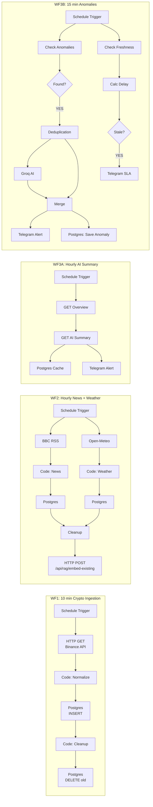
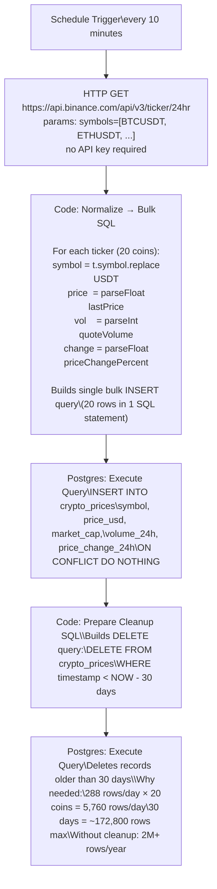
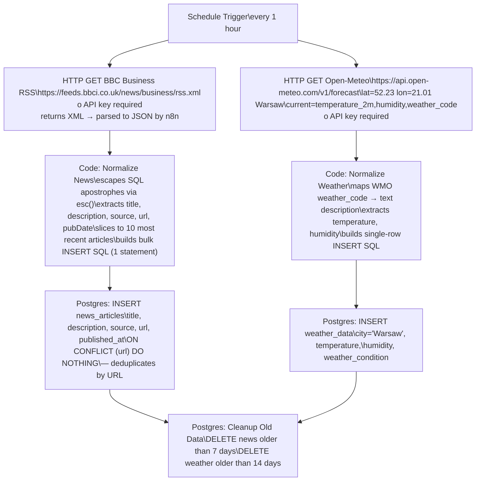
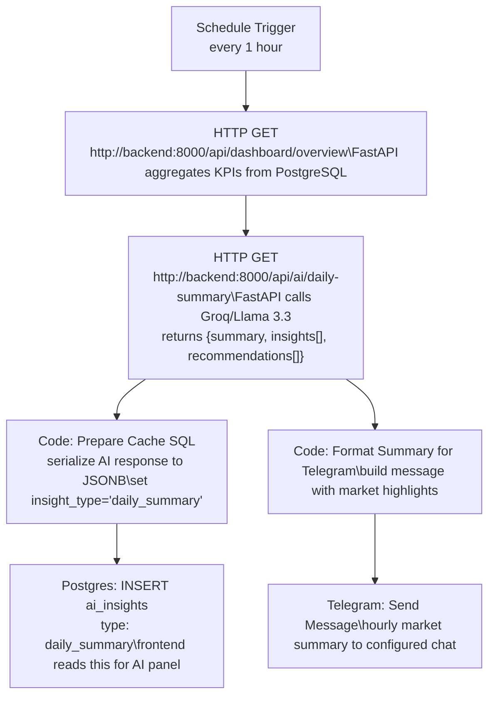
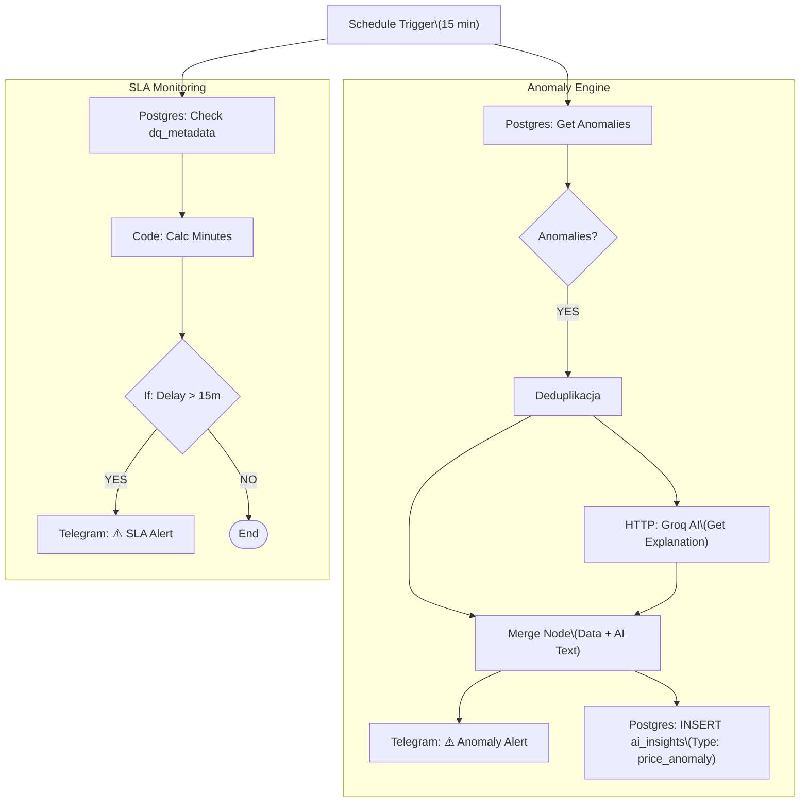
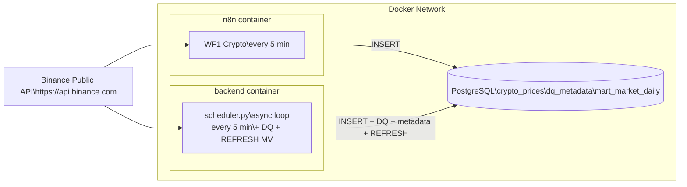

# n8n — Setup & Workflow Architecture

## Initial Setup (one-time)

1. Start the project: `docker compose up -d`
2. Open n8n: `http://localhost:5678`
3. Log in using credentials from `.env` (`N8N_BASIC_AUTH_USER` / `N8N_BASIC_AUTH_PASSWORD`)

### Step 1 — Create Postgres Credential

`Settings → Credentials → Add Credential → Postgres`

| Field    | Value                                    |
| -------- | ---------------------------------------- |
| Name     | `Dashboard PostgreSQL`                   |
| Host     | `postgres` (not `localhost`!)            |
| Port     | `5432`                                   |
| Database | value of `POSTGRES_DB` from `.env`       |
| User     | value of `POSTGRES_USER` from `.env`     |
| Password | value of `POSTGRES_PASSWORD` from `.env` |
| SSL      | `disable`                                |

### Step 2 — Import Workflow

`Workflows → Import from File` → select `n8n/workflows/workflow.json`

> This single file contains all four workflows. n8n will import them all at once.

### Step 3 — Assign Credential

In each workflow, click every **Postgres** node → **Credential** field → select `Dashboard PostgreSQL`.

### Step 4 — (Optional) Configure Telegram Alerts

WF3A (hourly AI summary) and WF3B (anomaly alerts) send notifications via Telegram Bot API.

**To enable Telegram notifications:**

1. Create a Telegram bot via [@BotFather](https://t.me/BotFather) — you'll receive a `BOT_TOKEN`
2. Find your `CHAT_ID` using [@userinfobot](https://t.me/userinfobot) or by messaging your bot and checking `https://api.telegram.org/bot<TOKEN>/getUpdates`
3. Set both values in `.env`:
   ```
   TELEGRAM_BOT_TOKEN=your_token_here
   TELEGRAM_CHAT_ID=your_chat_id_here
   ```
4. In WF3A, locate the `telegram 1 hour summary` node — verify the Bot Token and Chat ID match your `.env`
5. In WF3B, locate the `telegram anomaly alert 15 min` node — same verification

> **Skip this step** if you don't want Telegram notifications. Both workflows function without it — alerts simply won't be sent, and all other steps (DB INSERT, AI explanation, DQ reporting) continue normally.

### Step 5 — Activate

Toggle the **Active** switch on each workflow.

---

## Workflow Architecture Overview



---

## WF1: Crypto Ingestion — Detailed Flow



> **Note:** n8n WF1 and the backend `scheduler.py` both insert into `crypto_prices`. This is intentional redundancy — the scheduler is the safety net during n8n downtime. `ON CONFLICT DO NOTHING` silently discards duplicates. The backend scheduler also runs the full Data Quality Engine and refreshes `mart_market_daily` — WF1 does not.

---

## WF2: News & Weather — Parallel Branches



> **Why BBC RSS instead of NewsAPI?** BBC Business RSS requires zero registration, has no rate limits for reasonable use, and never requires key rotation. NewsAPI's free tier (100 req/day) and required key create friction for demo deployments. BBC RSS is reliable, business-focused, and completely keyless.

> **Why Open-Meteo instead of OpenWeatherMap?** Open-Meteo provides current weather + forecasts via a fully public API with no key, no rate limit, and no account required. OpenWeatherMap's free tier requires key registration and has stricter call limits.

---

## WF3A: Hourly AI Summary + Telegram



> WF3A runs every hour. This ensures the AI panel in the React dashboard reflects current market conditions throughout the trading day, and the Telegram chat receives regular updates. The `ai_insights` table retains the full history of generated summaries.

---

## WF3B: Monitoring Hub — Anomaly Detection (every 15 minutes) & Data Freshness & Deduplication



### Deduplication logic

The `Deduplikacja` node prevents repeated alerts for the same market event:

- It compares **symbol** and **absolute price change** (`ABS(price_change_24h)`) for each anomaly detected in the current 15‑minute window.
- If the same symbol already triggered an alert with a higher or equal absolute change, the new event is **skipped**.
- Only the most significant anomaly per symbol (largest `ABS(price_change_24h)`) is passed to the next steps.

This ensures that during prolonged market volatility, you don't receive multiple Telegram messages for the same coin every 15 minutes.

### Data Freshness Monitoring (SLA)

The system automatically monitors its own pulse.

- **Logic:** Uses `EXTRACT(EPOCH FROM (NOW() - last_successful_ts)) / 60` to calculate the delay in minutes.
- **Threshold:** If the delay > 15 minutes, the system triggers an urgent alert.
- **Reliability:** Uses HTML Parse Mode for Telegram to ensure complex data (like timestamps and table names) is displayed correctly without Markdown escaping issues.
- **Loose Type Validation:** The Condition node is configured to handle potential nulls or string/number mismatches gracefully, preventing workflow crashes during initial setup.
- **Deduplication** (`Deduplikacja` node) checks whether the same symbol was already alerted within the current check window. This prevents repeated Telegram messages for a price spike that persists across multiple 15-minute check cycles.

---

## Data Sources — No API Keys Required

All three external data sources used in the ETL workflows operate without registration.

| Source             | Endpoint                                 | Key required | Update frequency |
| ------------------ | ---------------------------------------- | ------------ | ---------------- |
| Binance Public API | `/api/v3/ticker/24hr`                    | ❌ NO        | every 5 min      |
| BBC Business RSS   | `feeds.bbci.co.uk/news/business/rss.xml` | ❌ NO        | every 1h         |
| Open-Meteo         | `api.open-meteo.com/v1/forecast`         | ❌ NO        | every 1h         |

This makes the project **instantly runnable** — `docker compose up` and all three data streams start flowing. Only `GROQ_API_KEY` is required for AI features (free tier: 14,400 requests/day). Telegram is entirely optional.

---

## n8n vs Backend Scheduler Relationship



**Both do the same thing — this is intentional redundancy.**

- **n8n WF1** runs every **10 minutes**: primary source, visible in UI, auditable, can be paused without code changes
- **scheduler.py** runs every **5 minutes**: safety net, keeps data flowing during n8n restarts, credential misconfigurations, or initial setup. It also runs the **Data Quality Engine**, updates **`dq_metadata`**, and refreshes **`mart_market_daily`** — WF1 does not.

The scheduler does _more_ than WF1:

- Runs the **Data Quality Engine** on every record before INSERT
- Updates **`dq_metadata`** for dbt freshness monitoring
- Calls **`REFRESH MATERIALIZED VIEW CONCURRENTLY mart_market_daily`** after each successful run

`ON CONFLICT DO NOTHING` discards any duplicate rows silently.

---

## Metabase Dashboard Setup

After completing the n8n setup, configure Metabase dashboards:

1. Open Metabase: `http://localhost:3001`
2. Complete the first-run wizard
3. Add your PostgreSQL database:
   - Host: `postgres`
   - Port: `5432`
   - Database: `business_intelligence`
   - User: `dashboarduser`
   - Password: (from `.env`)
   - SSL: disable
4. Create dashboards manually using the SQL queries in [`metabase/DASHBOARD_SETUP.md`](../metabase/DASHBOARD_SETUP.md)

Two dashboards are available:

- **Market Daily Overview** — real-time market metrics
- **dbt Analytics Dashboard** — dbt model visualisations

> Metabase Open Source does not support JSON import. The manual setup takes ~10 minutes.

## Troubleshooting

| Problem                                  | Cause                                           | Fix                                                                           |
| ---------------------------------------- | ----------------------------------------------- | ----------------------------------------------------------------------------- |
| Node shows "Install this node to use it" | `typeVersion` incompatible with n8n 1.34.2      | Delete node, re-add manually via UI                                           |
| `ENOTFOUND postgres` in n8n              | n8n can't resolve container hostname            | Check `DB_POSTGRESDB_HOST=postgres` in docker-compose                         |
| `400 Bad Request` from Binance           | Invalid `symbols` format (spaces in JSON array) | Ensure no spaces: `["BTCUSDT","ETHUSDT",...]`                                 |
| Workflow won't activate                  | Missing credential on Postgres node             | Click each Postgres node → assign `Dashboard PostgreSQL`                      |
| `Temporary failure in name resolution`   | DNS issue in container                          | Add `dns: [8.8.8.8, 1.1.1.1]` to the n8n service in docker-compose            |
| Telegram alert not sending               | Token or Chat ID not set                        | Set `TELEGRAM_BOT_TOKEN` and `TELEGRAM_CHAT_ID` in `.env`, restart containers |
| BBC RSS returns XML parse error          | n8n RSS node version mismatch                   | Use HTTP Request node + Code node to parse XML manually                       |
| dbt fails to connect                     | PostgreSQL not ready when dbt starts            | `docker compose restart dbt` after postgres is fully up                       |
| `mart_market_daily` empty in Metabase    | dbt hasn't run yet or ran before data arrived   | `docker compose run --rm dbt dbt run`                                         |
| No news articles in DB after WF2 run     | RSS feed returned empty or parse error          | Check n8n execution log → WF2 → `GET BBC Business RSS` node output            |
