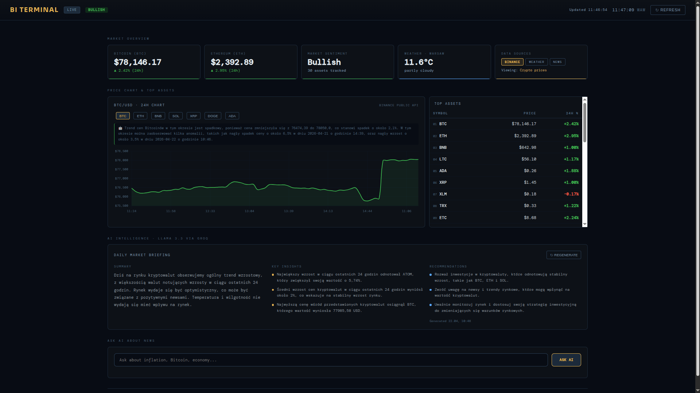
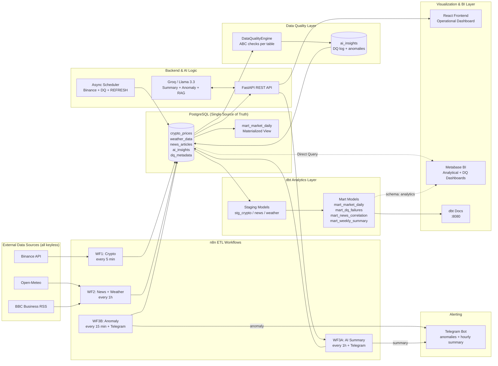

# AI-Powered Business Intelligence Dashboard

> Automated market data reporting system with real-time AI analysis, semantic news search, and event-driven alerting

[](/)
[](LICENSE)
[](/)
[](/)
[](/)
[](https://github.com/shopatomek/Projekt5/actions/workflows/main.yml)


## 📊 About the Project

A production-grade, fully automated data platform that ingests real-time market data from multiple keyless sources (crypto via Binance, weather via Open-Meteo, news via BBC Business RSS), orchestrates ETL workflows with n8n, enforces **strict modular data quality validation** at the pipeline layer, generates actionable AI insights using Llama 3.3 (Groq), transforms raw data through a **dbt analytics layer**, and visualizes everything in an interactive React dashboard with a dedicated Metabase BI layer.

### 💡 Business Value & Innovation (Market 2026 Ready)

This project is not just a dashboard—it's an **intelligent data orchestration layer** addressing the critical challenges of modern BI systems:

- **Data Reliability:** Custom-built Data Quality engine (using ABC pattern) prevents "data hallucinations" and ensures market metrics are validated before reaching the AI layer.
- **Data Mesh** – The project can be seen as a **domain‑oriented data product** (crypto market analytics). Each source (Binance, BBC, Open‑Meteo) is treated as an independent domain with its own ingestion pipeline, quality checks, and transformation logic. The `dq_metadata` table provides **data observability** across domains.
- **Data Observability & SLA:** Integrated freshness monitoring that proactively alerts via Telegram if data ingestion delays exceed 15 minutes, ensuring the BI layer always reflects current market reality.
- **Cost-Effective AI:** Leveraging Groq (Llama 3.3 70B) provides sub-second inference times while maintaining minimal operational overhead (LLMOps).
- **LLMOps** – The RAG pipeline separates **embedding generation** (local, no API key) from **LLM inference** (Groq, pay‑per‑token). Cache layers (`SUMMARY_CACHE_TTL`, `TREND_CACHE_TTL`) reduce token consumption and API calls by 70–90%.
- **Zero‑Trust Security** – No API keys are required for the three main data sources (Binance, BBC, Open‑Meteo). All credentials (`GROQ_API_KEY`, `TELEGRAM_BOT_TOKEN`) are isolated in `.env` and never hard‑coded. Containers run as non‑root users with strict memory limits.
- **Semantic Intelligence:** Transitions from rigid SQL filters to a production-grade RAG (Retrieval-Augmented Generation) pipeline, allowing business users to "talk" to their data.

**What makes this project stand out:**

- 🔄 **Dual ingestion redundancy** — n8n fetches Binance data every **10 minutes** (visible, auditable workflow), while the async FastAPI scheduler runs every **5 minutes** (safety net + DQ + MV refresh). This guarantees zero data gaps during n8n restarts or credential reconfiguration.
- 🛡️ **Modular Data Quality Engine** — ABC-based validator classes (`NotNullCheck`, `RangeCheck`, `UrlFormatCheck`, `FutureTimestampCheck`) run after every ingestion cycle; failures are logged, auto-repaired where possible, and surfaced via `/api/dq/report` and Metabase
- 🤖 **AI-powered pipeline** — Groq/Llama 3.3 explains detected price anomalies, generates hourly market summaries, powers full-text news search with AI synthesis, and drives semantic RAG search over BBC articles
- 📊 **Full analytics separation** — React handles operational metrics; Metabase handles ad-hoc analytical queries; dbt manages the SQL transformation layer; all share the same PostgreSQL source of truth
- 🚨 **Event-driven alerting** — price anomalies detected by n8n (>5% change in 15 min) trigger real-time Telegram notifications automatically; hourly AI summaries also delivered via Telegram
- 🔌 **Zero API key friction** — Binance, BBC RSS, and Open-Meteo all work without registration; only Groq requires a free key
- 📦 **Production-grade Docker** — memory limits, healthchecks, and a multi-stage nginx build keeping frontend at ~40 MB RAM
- 🏗️ **dbt analytics layer** — staging models normalize raw data; mart models deliver cross-source aggregations (market daily, news correlation, weather correlation, DQ trend); dbt docs served at `:8080`
- 📈 **ML Price Prediction** - The dashboard includes a **time‑series forecasting endpoint** that predicts crypto prices for the next N hours using LinearRegression.

**Business context:** 41% of Polish companies identify reporting automation as their top IT priority for 2025/2026. This project demonstrates how to build a resilient, self-healing BI pipeline combining traditional ETL with AI enrichment, modular data quality, dbt transformations, and semantic search — ready to scale from a local dashboard to a production analytics platform.

## 🛠️ Tech Stack

| Layer                  | Technology                                      |
| ---------------------- | ----------------------------------------------- |
| **AI / LLM**           | Groq API + Llama 3.3 70B Versatile              |
| **Backend**            | Python 3.11, FastAPI, SQLAlchemy, httpx         |
| **Database**           | PostgreSQL 15 with pgvector extension           |
| **ETL Orchestration**  | n8n 1.34.2                                      |
| **SQL Transformation** | dbt Core + dbt-postgres (staging → mart layer)  |
| **Embeddings**         | sentence-transformers `paraphrase-MiniLM-L3-v2` |
| **Frontend**           | React 18, Chart.js, Axios                       |
| **Frontend serving**   | nginx:alpine (multi-stage build)                |
| **BI Layer**           | Metabase v0.59                                  |
| **Crypto data**        | Binance Public API (no key required)            |
| **Weather data**       | Open-Meteo (no key required)                    |
| **News data**          | BBC Business RSS (no key required)              |
| **Alerting**           | Telegram Bot API (optional)                     |
| **Infrastructure**     | Docker, Docker Compose                          |
| **CI/CD**              | GitHub Actions (lint + security + docker build) |
| **ML / Forecasting**   | scikit-learn (LinearRegression)                 |

---

## 🏗️ Architecture



---

## 🚀 Quick Start

### Prerequisites

- Docker Desktop (or Docker Engine + Compose plugin)
- Git
- 1 API key: Groq — free tier, 14,400 req/day → [console.groq.com](https://console.groq.com)

### Automated Setup (recommended)

```bash
git clone https://github.com/shopatomek/Projekt5.git
cd Projekt5
bash setup.sh
```

`setup.sh` checks prerequisites, configures `.env` interactively, builds all images, and verifies the stack is healthy.

### Manual Setup

```bash
# 1. Clone
git clone https://github.com/shopatomek/Projekt5.git
cd Projekt5

# 2. Configure environment
cp .env.example .env
# Edit .env — set GROQ_API_KEY (required for AI features)
# Optionally set TELEGRAM_BOT_TOKEN + TELEGRAM_CHAT_ID for alerts

# 3. Start all services
docker compose up -d --build

# 4. Open in browser
# React Dashboard:  http://localhost:3000
# Metabase BI:      http://localhost:3001  (first-run wizard)
# n8n workflows:    http://localhost:5678  (first-run setup — see N8N_SETUP_AND_ARCHITECTURE.md)
# API Docs:         http://localhost:8000/docs
# pgAdmin:          http://localhost:5050
# dbt Docs:         http://localhost:8080
```

> ⚠️ **n8n requires one-time manual setup** after first run. See [N8N_SETUP_AND_ARCHITECTURE.md](N8N_SETUP_AND_ARCHITECTURE.md) for step-by-step instructions.

---

## 🛡️ Data Quality Validation

The project uses a modular, extensible Data Quality Engine built on Python ABCs. Every ingestion cycle runs records through a typed validator chain — failures are collected, auto-repaired where possible, logged to stdout, and written to `ai_insights` for dashboard visibility.

### Architecture

```
backend/data_quality/
├── base.py       # Abstract DataQualityCheck — validate() + fix()
├── checks.py     # NotNullCheck, RangeCheck, UrlFormatCheck, FutureTimestampCheck
├── engine.py     # DataQualityEngine — runs check chain, returns DQReport
└── reporters.py  # LogReporter (stdout) + DatabaseReporter (ai_insights)
```

### Validation Rules by Table

| **Crypto**         | **Rule**      | **Example failure**               |
| ------------------ | ------------- | --------------------------------- |
| `price_usd`        | > 0           | `-100` → "Invalid price for BTC"  |
| `volume_24h`       | >= 0          | `-5000` → "Negative volume"       |
| `price_change_24h` | ±100%         | `150` → "Unrealistic change"      |
| `timestamp`        | not in future | `2099-01-01` → "Future timestamp" |

| **Weather**         | **Rule**     | **Example failure**           |
| ------------------- | ------------ | ----------------------------- |
| `temperature`       | -50°C … 50°C | `-60` → "Invalid temperature" |
| `humidity`          | 0 … 100%     | `110` → auto-repaired to 100  |
| `weather_condition` | not empty    | `""` → "Missing condition"    |

| **News** | **Rule**                | **Example failure**           |
| -------- | ----------------------- | ----------------------------- |
| `title`  | not empty               | `""` → "Missing title"        |
| `url`    | valid http/https format | `"not-a-url"` → "Invalid URL" |
| `source` | not empty               | `""` → "Missing source"       |

### DQ Report Endpoint

```bash
curl http://localhost:8000/api/dq/report
```

```json
{
  "period_hours": 24,
  "summary": {
    "total_dq_events": 6,
    "tables_with_issues": ["crypto_prices"],
    "most_common_failure": "RangeCheck:price_change_24h",
    "total_anomalies": 2
  },
  "by_table": {
    "crypto_prices": { "failures": 6 }
  },
  "recent_failures": [...],
  "recent_anomalies": [...]
}
```

---

## 🤖 AI Features

### Hourly Market Summary

Generated every hour by n8n WF3A. Calls `/api/ai/daily-summary` which aggregates all market data and asks Llama 3.3 to produce a structured report (summary, top insights, recommendations). The result is cached in `ai_insights` and forwarded to Telegram.

### Anomaly Detection + Explanation

n8n WF3B checks every 15 minutes for price changes exceeding ±5%. When detected:

1. Deduplication prevents duplicate alerts for the same event
2. Groq generates a plain-language explanation of the anomaly
3. Alert is written to `ai_insights` (type: `price_anomaly`)
4. Telegram notification is sent automatically
5. Frontend surfaces the alert in the AI Insights panel

### Semantic News Search (RAG)

```bash
POST /api/rag/query
{"question": "What is the impact of inflation on crypto?", "limit": 5}
```

- Embeds the query with `paraphrase-MiniLM-L3-v2` (local model, no external API needed)
- Finds semantically relevant BBC articles using pgvector HNSW cosine similarity
- Passes top-5 articles as context to Llama 3.3
- Returns grounded answer with source citations and similarity scores

Full-text keyword search with AI synthesis is also available: `GET /api/news/search?q=bitcoin+inflation`

---

### 📈 ML Price Prediction

The dashboard includes a **time‑series forecasting endpoint** that predicts crypto prices for the next N hours.

**How it works:**

- Model: **LinearRegression** from scikit-learn
- Features: UNIX timestamp, hour-of-day (sin/cos), day-of-week (sin/cos)
- Training data: last 7 days of historical `crypto_prices`
- Forecast horizon: up to 48 hours (default 12, frontend uses 6)

**API endpoint:**

```bash
curl "http://localhost:8000/api/ml/predict?symbol=BTC&hours=12"
```

---

## 📊 dbt Analytics Layer

dbt transforms raw PostgreSQL tables into a clean analytics layer accessible from Metabase.

```
dbt/models/
├── staging/                              # Views normalizing raw source tables
│   ├── stg_crypto_prices.sql            # Filters price_usd > 0, localizes timestamps
│   ├── stg_news_articles.sql            # Cleans nulls, adds date column
│   └── stg_weather_data.sql             # Localizes timestamps, renames fields
└── marts/                               # Materialized tables for Metabase
    ├── mart_market_daily.sql            # Daily BTC/ETH + news count + weather + DQ failures
    ├── mart_weekly_summary.sql          # Weekly aggregates
    ├── mart_news_correlation.sql        # News volume vs. BTC daily % change
    ├── mart_weather_crypto_correlation.sql  # Temperature vs. BTC price
    ├── mart_dq_failures.sql             # DQ failure log (view)
    └── mart_dq_trend.sql               # DQ failures per day per table (table)
```

dbt runs automatically at container start and serves docs at **http://localhost:8080**.

Data freshness is monitored via the `dq_metadata` table — dbt raises a warning if `crypto_prices` has not been updated in 10 minutes, and an error after 20 minutes.

---

## 📊 Metabase Dashboards

The repository contains **two pre‑configured dashboards** (JSON files in `metabase/`):

- `Market_Daily_Overview.json` — real‑time market metrics (BTC/ETH prices, sentiment, anomalies, top assets)
- `dbt_Analytics_Dashboard.json` — advanced analytics based on dbt models (weekly summary, news correlation, DQ trend)

### Option 1: Import JSON (Metabase Enterprise)

If you have Metabase Enterprise, import the JSON files via **Settings → Admin → Dashboards → Import**.

### Option 2: Manual Setup (Metabase Open Source)

Since Metabase Open Source does not support JSON import, you can manually create the dashboards using the SQL queries provided in [`metabase/DASHBOARD_SETUP.md`](metabase/DASHBOARD_SETUP.md).

**Quick setup steps:**

1. Open Metabase at `http://localhost:3001`
2. Add your PostgreSQL database (host: `postgres`, database: `business_intelligence`, user: `dashboarduser`)
3. Create a new dashboard (e.g., "Market Daily Overview")
4. Add each card using the SQL queries from `DASHBOARD_SETUP.md`
5. Repeat for the second dashboard ("dbt Analytics Dashboard")

> The manual setup takes ~10 minutes and ensures full compatibility with Metabase Open Source.

## 📡 API Endpoints

| Endpoint                                         | Description                                                |
| ------------------------------------------------ | ---------------------------------------------------------- |
| `GET /`                                          | Health check                                               |
| `GET /api/dashboard/overview`                    | Aggregated KPIs: crypto, weather, news                     |
| `GET /api/charts/crypto-trend?symbol=BTC&days=7` | Time-series + AI trend analysis                            |
| `GET /api/ai/daily-summary`                      | Market report (Llama 3.3)                                  |
| `GET /api/dq/report?hours=24`                    | Data quality metrics + recent anomalies                    |
| `GET /api/news/search?q=...`                     | Full-text news search + AI summary                         |
| `GET /api/ml/predict?symbol=BTC&hours=12`        | ML price forecast (LinearRegression, confidence intervals) |
| `POST /api/rag/query`                            | Semantic search (pgvector) + RAG answer                    |
| `POST /api/rag/embed-existing`                   | One-time embedding backfill for articles                   |
| `POST /api/ai/explain-anomaly`                   | Anomaly explanation (called by n8n WF3B)                   |

Interactive docs: `http://localhost:8000/docs`

---

## 📁 Project Structure

```
Projekt5/
├── docker-compose.yml          # Production stack (7 services)
├── docker-compose.dev.yml      # Dev override (hot-reload)
├── setup.sh                    # Automated setup script
├── .env.example
├── backend/
│   ├── app.py                  # FastAPI entry point + lifespan scheduler + /api/ml/predict
│   ├── scheduler.py            # Async Binance fetcher (redundancy + DQ + REFRESH MV)
│   ├── ai_insights.py          # Groq/Llama: summary, trend analysis, anomaly explain
│   ├── analytics.py            # KPI calculation layer
│   ├── database.py             # SQLAlchemy engine + universal execute_query()
│   ├── embeddings.py           # sentence-transformers model + pgvector embed logic
│   ├── ml_predictions.py       # LinearRegression time-series forecasting
│   ├── data_quality/
│   │   ├── base.py             # ABC DataQualityCheck (validate + fix interface)
│   │   ├── checks.py           # NotNullCheck, RangeCheck, UrlFormatCheck, FutureTimestampCheck
│   │   ├── engine.py           # DataQualityEngine orchestrator + DQReport dataclass
│   │   └── reporters.py        # LogReporter (stdout) + DatabaseReporter (ai_insights)
│   ├── Dockerfile              # python:3.11-slim (with --default-timeout=1000)
│   ├── requirements.txt        # includes scikit-learn==1.4.2
│   └── tests/
│       ├── test_checks.py               # Unit tests for all check classes
│       ├── test_data_quality.py         # Integration tests for engine + reporters
│       └── test_ml_predictions.py       # Unit tests for ML forecasting
├── database/
│   ├── init.sql                # Schema: tables, indexes, materialized views, pgvector
│   └── init-metabase.sh        # Creates metabase_app DB on first run
├── dbt/
│   ├── dbt_project.yml         # Project config (staging → analytics schema)
│   ├── profiles.yml            # PostgreSQL connection from env vars
│   └── models/
│       ├── sources.yml         # Source definitions + freshness thresholds
│       ├── staging/            # stg_crypto_prices, stg_news_articles, stg_weather_data
│       └── marts/              # 6 mart models + schema.yml with dbt tests
├── frontend/
│   ├── src/App.js              # React dashboard (Bloomberg Terminal dark theme + ML Forecast toggle)
│   ├── Dockerfile              # CRA dev server (used with docker-compose.dev.yml)
│   ├── Dockerfile.prod         # Multi-stage: Node.js builder + nginx:alpine
│   └── package.json
├── n8n/
│   └── workflows/
│       └── workflow.json       # All 4 workflows in one importable file
├── metabase/
│   ├── dbt_Analytics_Dashboard.json   # Importable Metabase dashboard (dbt marts)
│   ├── Market_Daily_Overview.json     # Importable Metabase dashboard (market overview)
│   └── DASHBOARD_SETUP.md             # Manual SQL setup instructions (Open Source)
├── docs/
│   └── screenshots/            # Dashboard screenshots for README
└── .github/
    └── workflows/
        └── main.yml            # CI: ruff lint + trufflehog security + docker build
```

---

## 🖥️ Running Modes

### Production / Demo (default, ~3 GB RAM)

```bash
docker compose up -d --build
```

### Development (hot-reload)

```bash
docker compose -f docker-compose.yml -f docker-compose.dev.yml up
```

Frontend via CRA dev server (~2–3 GB RAM extra) — use only when actively editing code.

---

## ✅ Verifying the Setup

```bash
# Check crypto data is flowing
docker logs dashboard-backend | grep "Binance"

# Direct DB query
docker exec dashboard-postgres psql -U dashboarduser -d business_intelligence \
  -c "SELECT symbol, price_usd, timestamp FROM crypto_prices ORDER BY timestamp DESC LIMIT 5;"

# Test DQ report
curl http://localhost:8000/api/dq/report

# Test semantic RAG search
curl -X POST http://localhost:8000/api/rag/query \
  -H "Content-Type: application/json" \
  -d '{"question": "bitcoin market trend", "limit": 3}'

# Check all services are healthy
docker compose ps
```

---

## 📊 Service Overview

| Service             | Port | RAM Limit | Description                         |
| ------------------- | ---- | --------- | ----------------------------------- |
| PostgreSQL/pgvector | 5432 | 256 MB    | Primary data store                  |
| n8n                 | 5678 | 600 MB    | ETL workflow orchestration          |
| Backend (FastAPI)   | 8000 | 384 MB    | REST API + AI + scheduler           |
| Frontend (nginx)    | 3000 | 64 MB     | React dashboard (multi-stage build) |
| pgAdmin             | 5050 | 356 MB    | Database management UI              |
| Metabase            | 3001 | 768 MB    | BI analytics layer                  |
| dbt                 | 8080 | 512 MB    | SQL transformations + docs server   |
| **Total**           |      | **~3 GB** |                                     |

---

## 🔑 API Keys

| Source               | Free Limit                   | Key Required | Sign Up                                                            |
| -------------------- | ---------------------------- | ------------ | ------------------------------------------------------------------ |
| **Groq (LLM)**       | 14,400 req/day (Llama 3.3)   | ✅ YES       | [console.groq.com](https://console.groq.com)                       |
| **Binance**          | Unlimited (public endpoints) | ❌ NO        | —                                                                  |
| **Open-Meteo**       | 10,000/day                   | ❌ NO        | [open-meteo.com](https://open-meteo.com)                           |
| **BBC Business RSS** | Unlimited                    | ❌ NO        | [feeds.bbci.co.uk](https://feeds.bbci.co.uk/news/business/rss.xml) |
| **Telegram Bot**     | Unlimited                    | Optional     | [@BotFather](https://t.me/BotFather) on Telegram                   |

---

## 🗺️ Roadmap

- [x] MVP — crypto data + AI insights
- [x] Docker deploy with nginx (RAM-optimized multi-stage build)
- [x] n8n ETL workflows (4 workflows: crypto, news/weather, AI summary, anomaly detection)
- [x] Active Data Observability: n8n-based freshness alerts (SLA monitoring) for dq_metadata
- [x] Migration Gemini → Groq (Llama 3.3 70B)
- [x] Production-grade RAG: Frontend-driven semantic search (React + FastAPI + pgvector)
- [x] Async backend scheduler (redundant Binance ingestion + DQ + MV refresh)
- [x] Metabase BI integration (separate analytical layer, isolated `metabase_app` DB)
- [x] GitHub Actions CI/CD (ruff lint + trufflehog security scan + docker build)
- [x] Modular Data Quality Engine (ABC pattern, auto-repair, `/api/dq/report`)
- [x] n8n anomaly alerts → Telegram Bot
- [x] Hourly AI summary → Telegram Bot
- [x] pgvector + RAG endpoint (`POST /api/rag/query`) + full-text search
- [x] Materialized views — SQL mart layer (`mart_market_daily`)
- [x] dbt analytics layer — staging → mart models with schema tests + dbt docs
- [x] dbt data freshness monitoring (`dq_metadata` table)
- [ ] JWT authentication layer
- [ ] PDF report export
- [x] ML price predictions (scikit-learn / statsmodels)

---

## 👨‍💻 Author

**Tomasz Szopa** — Data Engineer / AI Engineer

- GitHub: [github.com/shopatomek](https://github.com/shopatomek)

## 📝 License

MIT — see [LICENSE](LICENSE) for details
